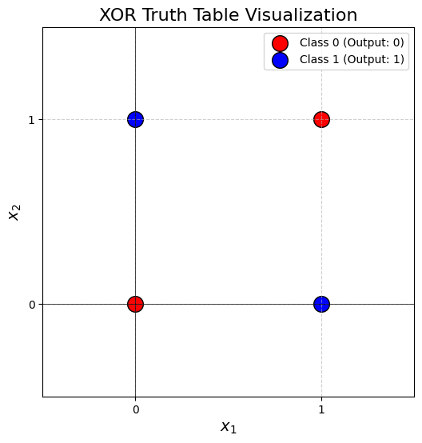
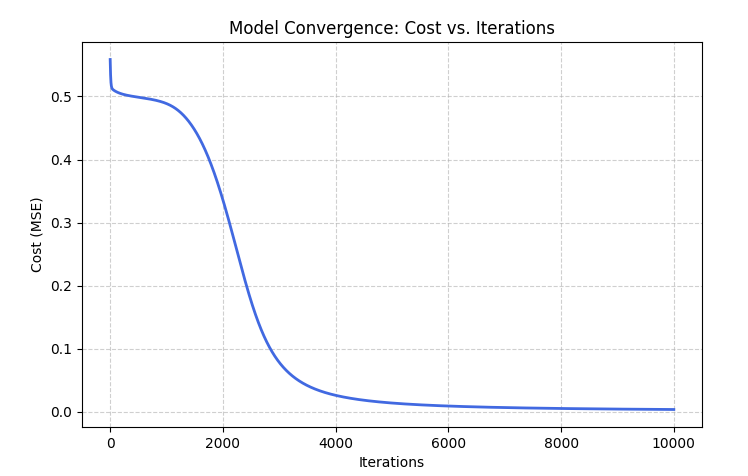

# Neural Network learns XOR Logical Operation : Python Implementation from Scratch

This is a mini-project that implements a neural network from scratch to learn the **XOR logical operation**. It is built in **Python** by only using the libraries **NumPy** and **Matplotlib**.

## Why XOR?
If we use machine learning, XOR problem cannot be solved. It's because XOR is **not linearly separable**. A single layer perceptron cannot find the optimal decision boundary (Check Figure below). This project shows how using a hidden layer with a non-linear activation function (Sigmoid) can learn the complex decision boundary to solve XOR problem.

    

## What is XOR?
XOR (Exclusive OR) logical operation returns output 1 when inputs are different; otherwise, it returns 0. Here is the truth table for XOR Logic Gate:

| Input $x_1$ | Input $x_2$ | Output $y$ |
| :---: | :---: | :---: |
| 0 | 0 | **0** |
| 0 | 1 | **1** |
| 1 | 0 | **1** |
| 1 | 1 | **0** |

## Network Architecture
- **Input Layer:** 2 nodes ($x_1, x_2$)
- **Hidden Layer:** 5 nodes with Sigmoid activation
- **Output Layer:** 1 node with Sigmoid activation
- **Optimization:** Gradient Descent with manual Backpropagation

    

## Mathematical Implementation
The network uses the **Sigmoid** activation function:
$$S(z) = \frac{1}{1 + e^{-z}}$$

Its derivative for the backpropagation step:
$$S'(z) = S(z) \cdot (1 - S(z))$$

The model minimizes the **Mean Squared Error (MSE)** using Gradient Descent:
$$J = \frac{1}{2} \sum (y - \hat{y})^2$$

This implementation updates both **weights** and **biases** for better convergence.

## Results

### Convergence
The model successfully minimizes the Mean Squared Error (MSE) over 10,000 iterations (Check Convergence Plot).

  

### Final Model Accuracy
After training, the model produces the following outputs for the XOR truth table:

| Input (x1, x2) | Raw Probability | Rounded Output |
| :--- | :--- | :--- |
| (0, 0) | 0.0247 | **0** |
| (0, 1) | 0.9522 | **1** |
| (1, 0) | 0.9558 | **1** |
| (1, 1) | 0.0549 | **0** |